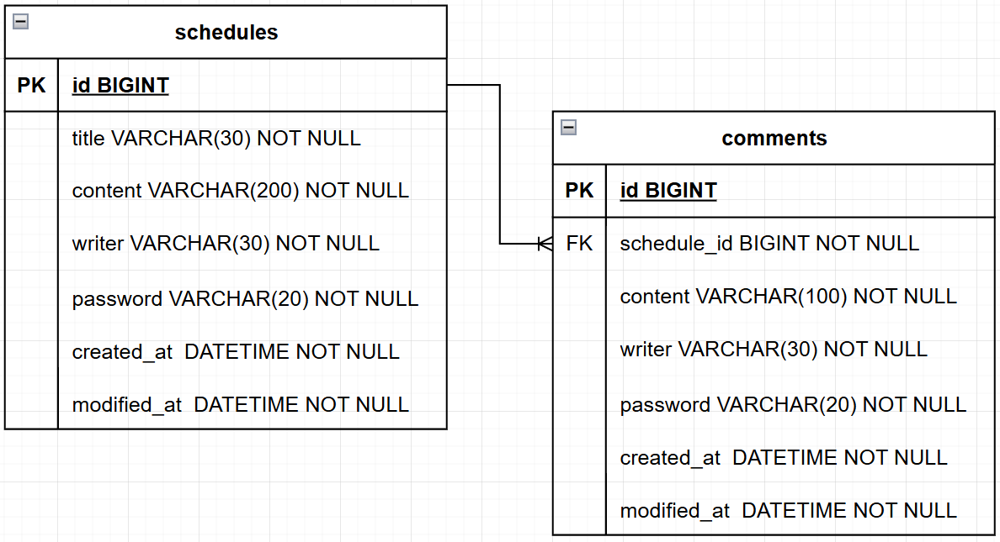

# Scheduler API

Spring Boot와 JPA를 사용해 구현한 일정 관리 앱 프로젝트입니다.

## 프로젝트 개요


일정을 생성, 조회, 수정, 삭제하고, 일정에 댓글을 작성할 수 있는 REST API 서버입니다.

## 기술 스택


## 주요 기능

- 일정 생성, 조회, 수정, 삭제
- 댓글 생성
- 일정 단건 조회 시 댓글 목록 포함
- 제목, 내용, 댓글 내용 및 필수값 검증

## API 요약

| Method   | URL                                  | 설명         |
|----------|--------------------------------------|------------|
| `POST`   | `/schedules`                         | 일정 생성      |
| `GET`    | `/schedules`                         | 전체 일정 조회   |
| `GET`    | `/schedules?writer={writer}`         | 작성자별 일정 조회 |
| `GET`    | `/schedules/{id}`                    | 선택 일정 조회   |
| `PUT`    | `/schedules/{id}`                    | 일정 수정      |
| `DELETE` | `/schedules/{id}`                    | 일정 삭제      |
| `POST`   | `/schedules/{scheduleId}/comments`   | 댓글 생성      |


상세 요청/응답 예시는 [API 명세서](./docs/api-spec.md)에서 확인할 수 있습니다.

## ERD



## 프로젝트 구조

```text
 main
 ├─ java/com/vanilalatte/scheduler
 │  ├─ controller
 │  ├─ dto
 │  ├─ entity
 │  ├─ repository
 │  ├─ service
 │  └─ SchedulerApplication.java
 └─ resources
    └─ application.properties
```

각 계층의 역할은 다음과 같습니다.

- `controller` : HTTP 요청/응답 처리
- `dto` : 요청 및 응답 데이터 전달
- `entity` : 일정, 댓글, 공통 시간 필드 정의
- `repository` : 데이터 접근
- `service` : 일정/댓글 비즈니스 로직 및 입력값 검증 처리

## 실행 방법

### 1. MySQL 준비

```sql
CREATE DATABASE scheduler_db;
```

### 2. 환경 설정

`src/main/resources/application.properties`에서 DB 정보를 수정합니다.

```properties
spring.datasource.url=jdbc:mysql://localhost:3306/scheduler_db
spring.datasource.username=your_username
spring.datasource.password=your_password
```

### 3. 애플리케이션 실행

```bash
./gradlew bootRun
```

> Windows 환경에서는 `gradlew.bat bootRun`을 사용합니다.

기본 실행 주소: `http://localhost:8080`


## 구현 포인트

- `BaseEntity`에 `createdAt`, `modifiedAt`을 두고 공통으로 관리했습니다.
- 전체 일정 조회는 `modifiedAt` 기준 내림차순으로 반환합니다.
- 수정은 `title`, `writer`만 허용합니다.
- 수정과 삭제는 요청 본문의 `password`와 저장된 비밀번호를 비교한 뒤 수행합니다.
- 일정 단건 조회 시 해당 일정의 댓글 목록을 함께 반환합니다.
- 댓글은 일정당 최대 10개까지 작성할 수 있습니다.
- 입력값의 필수 여부와 길이 제한을 서비스 계층에서 검증합니다.

## 트러블슈팅

### 입력값 검증을 DB 제약에만 의존했던 문제

초기에는 `@Column(nullable = false, length = ...)` 설정으로 검증이 충분하다고 판단했습니다.
하지만 이 방식은 빈 문자열이나 공백만 담긴 요청을 걸러내지 못하고,
잘못된 입력이 DB 저장 시점까지 도달한다는 한계가 있었습니다.

서비스 계층에서 필수값 여부와 길이 제한을 직접 검증하도록 수정했고,
유효하지 않은 요청은 DB 접근 전에 `400 Bad Request`로 응답하도록 개선했습니다.
